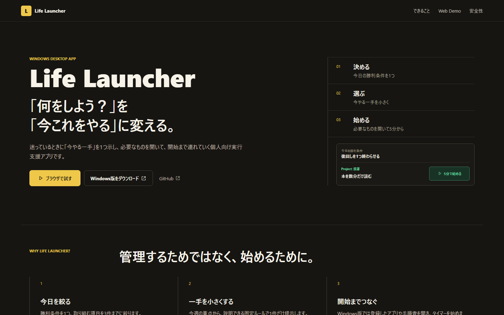

# Life Launcher

[日本語](README.md) | **English**

**A Windows app that turns “What should I do?” into “I will do this now.”**

Life Launcher is a local-first Windows desktop app that presents one next step, opens the environment needed for it, and helps you move from deciding to starting.

[Try it in your browser](https://life-launcher-web.takuyakou.workers.dev) · [Download Life Launcher v1.0.0 for Windows](https://github.com/Takuyakou/life-launcher/releases/tag/v1.0.0)


## Web Demo

Try the central Life Launcher flow in your browser without installing the Windows app.

[Open the Web Demo](https://life-launcher-web.takuyakou.workers.dev) · [View the Web Demo source](https://github.com/Takuyakou/life-launcher-web)



The Web Demo uses synthetic data and stores changes in your browser's localStorage. It simulates the “start and prepare the environment” flow without launching local apps, files, or URLs. It is a showcase, not a complete port of the Windows product.

## Highlights

- **Do Now**
  Presents one next step from this week's focus using fixed, explainable rules.

- **Daily Victory / Today's Three**
  Define one condition for a successful day and limit today's work to at most three items.

- **Quick Launcher / Dictionary**
  Register apps, folders, files, and URLs, then open them from the sidebar or `Ctrl+K` search.

- **Timer / Session Records**
  Start a short or normal timer and store sessions of at least one minute locally.

- **Instruction Viewer**
  Read Markdown, text, and sanitized HTML files from registered folders in a separate window.

## Screenshots

### Dictionary / Instruction Viewer

| Dictionary | Instruction Viewer |
| --- | --- |
|  |  |

The screenshots are generated deterministically from synthetic data. They do not contain real user configuration, activity, paths, or notes.

## Download

Download Life Launcher v1.0.0 from [GitHub Releases](https://github.com/Takuyakou/life-launcher/releases/tag/v1.0.0).

### Installer - Recommended

Use this for the standard installation flow.

`Life-Launcher-v1.0.0-windows-x64-setup.exe`

### Standalone EXE

Run the app directly without installing it.

`Life-Launcher-v1.0.0-windows-x64.exe`

### Portable ZIP

Extract the ZIP archive and run the portable app.

`Life-Launcher-v1.0.0-windows-x64-portable.zip`

> The current Windows binaries are not code-signed, so Windows SmartScreen may display a warning. Microsoft Edge WebView2 Runtime is required.

You can verify the release files with the included `SHA256SUMS.txt`.

## Runtime Requirements

- Windows 10 or later (x64)
- Microsoft Edge WebView2 Runtime

## Development

### Requirements

- Node.js 24
- Rust stable with the MSVC toolchain

```powershell
npm.cmd ci
npm.cmd run lint
npm.cmd run build
npm.cmd run test:visual
cargo check --manifest-path src-tauri/Cargo.toml
```

Run the Tauri development app:

```powershell
npm.cmd run tauri -- dev
```

Build local Windows packages:

```powershell
npm.cmd run package:windows
```

Public quality checks cover React / TypeScript lint and build, Playwright Visual QA, Rust check / test / clippy, and the public safety scan.

## Tech Stack

- Tauri 2 / Rust
- React 18 / TypeScript
- Vite 8
- Playwright for deterministic Visual QA
- Zod for frontend data validation

## Security

The public source includes bounded favicon retrieval, local and private destination rejection, redirect revalidation, response validation, and window-specific Tauri capabilities. Automated Rust tests cover the network and permission contracts. These controls reduce known risks but do not guarantee security.

## Local Data And Network Use

Life Launcher does not require an account or a Life Launcher server. Configuration, sessions, notes, backups, and icon cache data are stored locally under `%APPDATA%\life-launcher` or in a backup folder selected by the user.

The app has no telemetry, analytics, crash-reporting service, cloud synchronization, or automatic updater. When you register a URL, Life Launcher may fetch its favicon directly from the target origin. The fetch path rejects obvious local and private destinations and applies redirect, timeout, and response-size limits. Opening a registered URL launches your browser, whose network behavior is outside Life Launcher.

See [PRIVACY.md](PRIVACY.md) and [SECURITY.md](SECURITY.md) for details.

## Public Source

This repository starts at Life Launcher v1.0.0 with a clean public history. It intentionally excludes private development history, internal plans and reports, real runtime data, private screenshots, build outputs, and release binaries.

## License

No open-source license is granted. The source is visible for inspection, but use, modification, and redistribution are not permitted without the copyright holder's explicit permission. All rights reserved.
