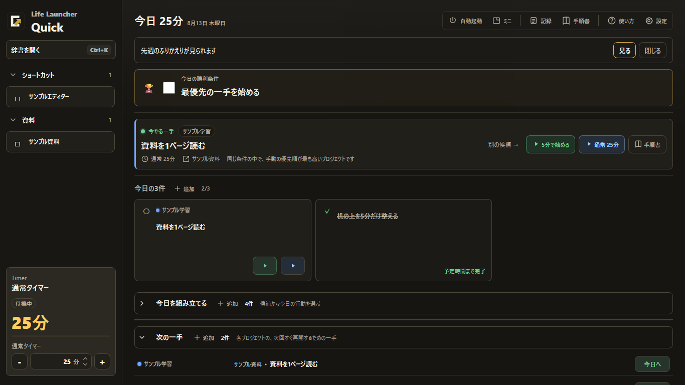
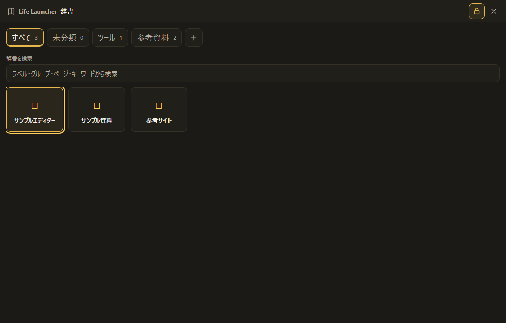
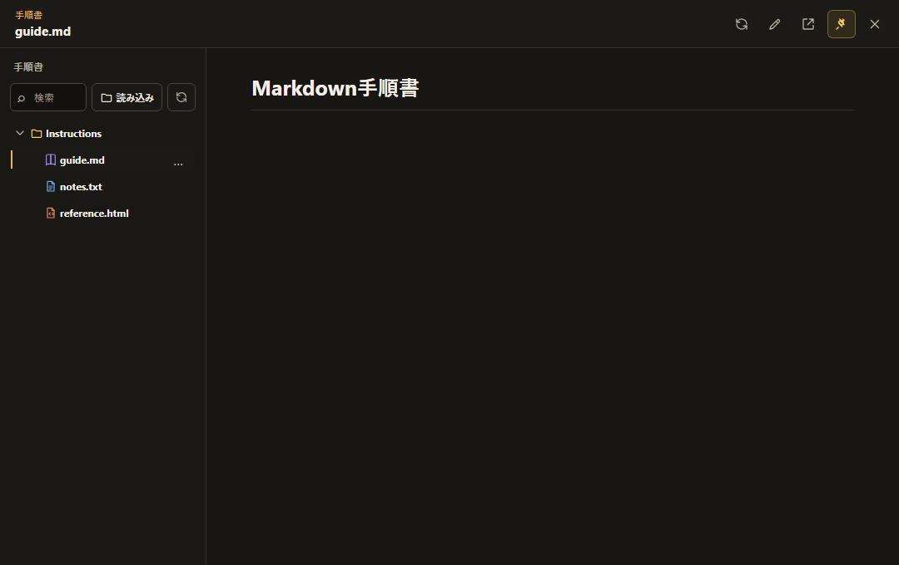

# Life Launcher

**日本語** | [English](README.en.md)

Life Launcher は、選んだ「次の一手」を行動に移すためのローカル完結型 Windows デスクトップランチャーです。小さな Quick サイドバー、検索可能なコマンド辞書、今日のフォーカス、タイマー、セッション記録、読み取り専用の手順ビューアを1つにまとめています。



## 主な機能

- よく使うアプリ・フォルダ・ファイル・リンクを Quick サイドバーに登録。
- `Ctrl+K` で大きな辞書を検索。
- 今日の勝利条件、今日の3件(最大3件)、おすすめの次の一手を選択。
- ショート/ノーマルのタイマーを、同じセッション記録経路から開始。
- ローカルのセッション履歴とプロジェクト合計を確認。
- 選んだフォルダから Markdown・テキスト・サニタイズ済み HTML の手順を閲覧。

## スクリーンショット

| 辞書 | 手順ビューア |
| --- | --- |
|  |  |

スクリーンショットは合成データから決定論的に生成されています。実際のユーザー設定・アクティビティ・パス・ノートは含まれていません。

## Download

### Installer - Recommended

通常はこちらを使用してください: `Life-Launcher-v1.0.0-windows-x64-setup.exe`

### Standalone EXE

インストールせず直接起動する版です: `Life-Launcher-v1.0.0-windows-x64.exe`

### Portable ZIP

ZIPを展開して使用する版です: `Life-Launcher-v1.0.0-windows-x64-portable.zip`

正式リリース後は[GitHub Releases](https://github.com/Takuyakou/life-launcher/releases)からダウンロードできます。配布ファイルの整合性は`SHA256SUMS.txt`で確認してください。

配布バイナリはWindows x64向けです。Microsoft Edge WebView2 Runtimeが必要です。

## 動作要件

- Windows 10 以降
- Node.js 24
- Rust stable(MSVC ツールチェーン)
- Microsoft Edge WebView2 ランタイム

## 開発

```powershell
npm.cmd ci
npm.cmd run lint
npm.cmd run build
npm.cmd run test:visual
cargo check --manifest-path src-tauri/Cargo.toml
```

Tauri 開発用アプリを起動:

```powershell
npm.cmd run tauri -- dev
```

ローカル向け Windows パッケージをビルド:

```powershell
npm.cmd run package:windows
```

## 技術スタック

- Tauri 2 / Rust
- React 18 / TypeScript
- Vite 8
- Playwright(決定論的なビジュアルチェック)
- Zod(フロントエンドのデータ検証)

## セキュリティ

公開ソースには、範囲を制限した favicon 取得、ローカル/プライベート宛先の拒否、リダイレクト再検証、レスポンス検証、ウィンドウ単位の Tauri ケーパビリティが含まれます。ネットワークと権限の契約は Rust の自動テストでカバーされています。これらの対策は既知のリスクを低減しますが、セキュリティを保証するものではありません。

## ローカルデータとネットワーク利用

Life Launcher はアカウントや専用サーバーを必要としません。設定・セッション・ノート・バックアップ・アイコンキャッシュは、`%APPDATA%\life-launcher` またはユーザーが選んだバックアップフォルダにローカル保存されます。

テレメトリ、解析、クラッシュレポート、クラウド同期、自動アップデータはありません。URL を登録すると、Life Launcher はその favicon を対象オリジンから直接取得する場合があります。取得経路は明らかなローカル/プライベート宛先を拒否し、リダイレクト・タイムアウト・レスポンスサイズの制限を適用します。登録した URL を開くとユーザーのブラウザが起動し、そのネットワーク挙動は Life Launcher の管理外です。

詳細は [PRIVACY.md](PRIVACY.md) と [SECURITY.md](SECURITY.md) を参照してください。

## 公開ソースについて

このリポジトリは Life Launcher v1.0.0 から、クリーンな公開履歴で始まっています。非公開の開発履歴、内部の計画書・報告書、実際の実行データ、非公開スクリーンショット、ビルド成果物、リリースバイナリは意図的に除外しています。

## ライセンス

オープンソースライセンスは付与されていません。ソースは閲覧可能ですが、著作権者の明示的な許可なく、使用・改変・再配布は認められません。All rights reserved.
